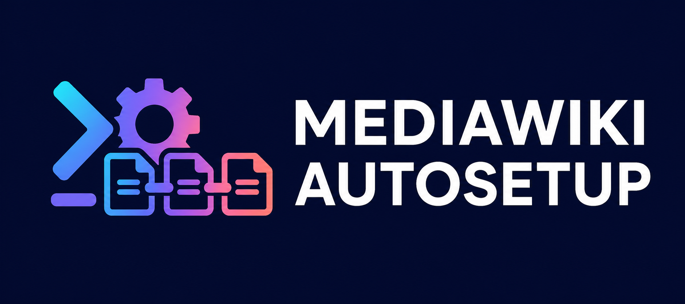

# MediaWiki Autosetup

<p align="center">
  
</p>

<div align="center">

[](https://github.com/vingaming1113/AutosetupMediawiki/actions/workflows/ci.yml)
[](https://github.com/vingaming1113/AutosetupMediawiki/blob/main/package.json)

[](https://github.com/vingaming1113/AutosetupMediawiki/blob/main/LICENSE)

[](https://github.com/vingaming1113/AutosetupMediawiki/stargazers)
[](https://github.com/vingaming1113/AutosetupMediawiki/issues)

[](https://github.com/vingaming1113/AutosetupMediawiki/commits/main)

</div>

A friendly Bun-powered terminal wizard that creates and optionally starts a complete MediaWiki installation with Docker.

Name your wiki, choose its language and URL, add a custom logo, create an administrator, and enable useful bundled extensions without manually writing Docker Compose or PHP configuration. Menus use the arrow keys and Space, and the finished setup appears in one clear summary card.

The cards above are live project statistics from GitHub and Shields.io, so build health, version, issue count, repository size, and activity remain current.

## Highlights

- Guided terminal interface with a cyan, violet, and rose gradient banner
- Arrow-key menus and a Space-driven extension picker
- CAPTCHA choices for [Cap.js](https://github.com/tiagozip/cap), Cloudflare Turnstile, hCaptcha, and Google reCAPTCHA v2
- Automatic Cap Standalone deployment and site-key creation, or connection to an existing Cap server
- MediaWiki 1.46 and MariaDB 11.4 on official container images
- Persistent wiki, database, and upload storage
- Generated database secrets and private `.env` handling
- Optional logo configuration
- Automatic installation when Docker Compose is available
- Safe generated-files fallback when Docker is unavailable
- Final card showing the URL, administrator, CAPTCHA, extensions, files, and commands

## Extensions

Choose any combination of these bundled MediaWiki extensions:

- VisualEditor
- WikiEditor
- Cite
- ParserFunctions
- TemplateData
- Scribunto
- SyntaxHighlight
- Nuke

## CAPTCHA protection

The wizard lists **Cap.js** first and recommends it as the privacy-friendly, self-hosted option. It also supports the managed CAPTCHA providers included with MediaWiki's ConfirmEdit extension:

| Provider | Where it runs | What the wizard needs |
| --- | --- | --- |
| **Cap.js (recommended)** | Generated with the wiki, or your existing server | Automatic: port and public URL; existing: URL and keys |
| **Cloudflare Turnstile** | Cloudflare | Site key and secret key |
| **hCaptcha** | hCaptcha | Site key and secret key |
| **Google reCAPTCHA v2** | Google | Site key and secret key |
| **No CAPTCHA** | — | Nothing; protection can be added later |

Managed providers load their provider's browser code and send challenge data to that service. Cap keeps the challenge service under your control. Choose the provider whose privacy terms and hosting model fit your wiki.

All enabled providers protect account creation, repeated failed logins, and edits that add external links. Administrators and other users with ConfirmEdit's `skipcaptcha` permission keep the standard bypass behavior. Remote IP forwarding is disabled for Turnstile, hCaptcha, and reCAPTCHA.

### Cap.js setup

After selecting Cap, choose one of two paths:

- **Set up Cap automatically** asks for a local port and the public URL browsers will use. The generated stack runs Cap Standalone and Valkey, creates a site key with instrumentation enabled, and allows the wiki's visitor-facing origin.
- **Use an existing Cap server** asks for its public URL, site key, and matching secret key.

Automatic setup deliberately pins Cap Standalone `3.1.7`, Valkey `9.0.4-alpine`, widget `0.1.56`, and WASM `0.0.7`. The generated wiki loads the widget from your Cap server, not a third-party CDN, submits Cap's native `cap-token` field, and verifies every submitted token server-side through `/siteverify`.

Cap must be publicly reachable by visitors. For a public wiki, route the chosen Cap URL through your reverse proxy and configure its DNS and TLS. Automatic setup stores the dashboard admin key only in `.env` and generated site credentials in a dedicated `cap-credentials` Docker volume. Existing-server secrets remain only in `.env`.

See [tiagozip/cap](https://github.com/tiagozip/cap) for Cap's source and documentation.

## Requirements

- [Bun](https://bun.sh/) 1.1 or newer
- [Docker](https://docs.docker.com/get-docker/) with Docker Compose for one-click installation

Docker is optional while generating the files. If it is unavailable, the wizard still creates the complete project and explains how to continue later.

## Quick start

```sh
git clone https://github.com/vingaming1113/AutosetupMediawiki.git
cd AutosetupMediawiki
bun install --frozen-lockfile
bun start
```

Use **Up/Down** to move through menus, **Space** to toggle extensions, and **Enter** to confirm.

The default output directory is `./mediawiki-setup`. When automatic installation succeeds, open the URL displayed in the final card and sign in using the administrator account you created.

## Generated project

| File | Purpose |
| --- | --- |
| `compose.yml` | MediaWiki, MariaDB, and optional automatic Cap services |
| `.env` | Port, setup values, database secrets, and optional CAPTCHA credentials |
| `install.php` | One-time unattended installer run inside the MediaWiki container |
| `cap-init.ts` | Idempotent Cap site-key bootstrap, generated only for automatic Cap setup |
| `LocalSettings.autosetup.php` | Wiki name, URL, logo, uploads, extensions, and CAPTCHA settings |
| `extensions/CapCaptcha/` | Server-validated ConfirmEdit adapter, generated only when Cap is selected |
| `data/images/` | Persistent uploads and the optional logo |
| `README.md` | Commands for operating the generated wiki |

From inside the generated directory:

```sh
docker compose up -d
docker compose logs -f
docker compose down
```

The first start waits for MariaDB, creates `LocalSettings.php`, installs MediaWiki, and then starts the web service. The installer is idempotent, so later starts keep the existing installation. To follow first-start progress, run `docker compose logs -f mediawiki-install mediawiki`.

Do not run `docker compose down -v` unless you intentionally want to delete the wiki and database volumes.

## Public websites

The generated stack serves HTTP on the selected port. For a public address such as `https://wiki.example.com`, place it behind Caddy, Traefik, nginx, or another reverse proxy and configure TLS and DNS separately. Enter the final visitor-facing URL in the wizard.

## Backups and security

- Keep `.env` and the automatic Cap `cap-credentials` volume private.
- Each generated `.env` uses a unique Compose project name so a regenerated setup cannot silently reuse older named volumes and credentials.
- Back up the MariaDB and MediaWiki volumes, `data/images/`, and automatic Cap's `cap-valkey-data` and `cap-credentials` volumes.
- Test backups before changing pinned MediaWiki or MariaDB image versions.
- Run `bun audit` whenever JavaScript dependencies change.
- Never paste credentials or private URLs into public issue reports.
- The generator refuses to overwrite a non-empty output directory.
- Setup failures hide raw exception details because Docker errors may contain credentials.

## Development

```sh
bun install --frozen-lockfile
bun audit
bun run typecheck
bun test
bun run start --help
```

The CI workflow performs the frozen install, dependency audit, type-check, tests, and CLI smoke test for every pull request.

## Troubleshooting

If setup stops while Docker is starting, enter the generated directory and run:

```sh
docker compose ps
docker compose logs database mediawiki mediawiki-install
```

For automatic Cap setup, also run `docker compose logs cap cap-init cap-valkey`.

For a port conflict, run the wizard again with a different port and a new output directory.

## Community

- [Report a reproducible bug](https://github.com/vingaming1113/AutosetupMediawiki/issues/new?template=01-bug-report.yml)
- [Suggest a feature](https://github.com/vingaming1113/AutosetupMediawiki/issues/new?template=02-feature-request.yml)
- [Browse current issues](https://github.com/vingaming1113/AutosetupMediawiki/issues)

Please remove passwords, tokens, private URLs, and other sensitive information from issue reports and logs.

## License

MIT. MediaWiki is a trademark of the Wikimedia Foundation; this independent utility is not affiliated with or endorsed by the Wikimedia Foundation.
